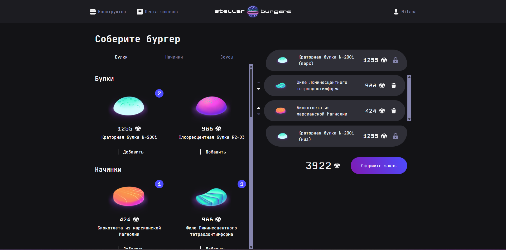
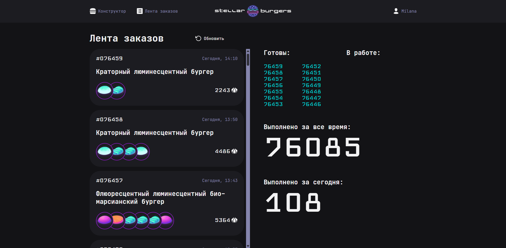

# Космическая бургерная с конструктором бургера 

## Структура проекта:
- src/ — файлы проекта.
- src/components — папка с TSX-компонентами.

### Важные файлы:
- cypress/e2e/constructor.cy.tsx — файл с тестами cypress.
- src/index.tsx — точка входа приложения.
- src/components/ui — папка с UI-компонентами.
- src/pages — папка с страницами.
- src/services — главный редьюсер и его тест.
- src/slices — слайсы и их тесты.
- src/utils/burger-api.ts — файл с API.
- src/utils/cookie.ts — функции для работы с куки.
- src/utils/types.ts — файл с типами.

## Что сделала 
- Настроила роутинг
- Написала функционал запросов данных с сервера, используя `Redux` и глобальный `store`
- Настроила авторизацию
- Создала защищённые роуты

## Реализованный функционал
- Конструктор бургера с выбором ингридиентов
- Авторизация и регистрация пользователя, хранение токенов
- Защищённые маршруты: доступ к профилю/истории заказов только после входа
- Навигация по приложению с помощью React Router
- Модальные окна для просмотра ингредиента/заказа
- Интеграция с сервером
- Тесты: Unit (Jest) и e2e (Cypress) 

## Технологии
- TS, CSS, React, Webpack, Jest, Cypress
- Работа с API, Git

## Инструкция по запуску
Для запуска проекта нужно выполнить несколько шагов:
1. Создайте папку и перейдите в неё: 
`cd name_folder`
2. Склонируйте данный репозиторий: 
`git clone https://github.com/MilanaMur/stellar-burgers.git`
3. Создайте файл `.env` для корректной работы запросов к серверу со следующей переменной:
`BURGER_API_URL=https://norma.nomoreparties.space/api` 
4. Установите зависимости:
`npm install`
5. Запустите проект:
`npm run start`
